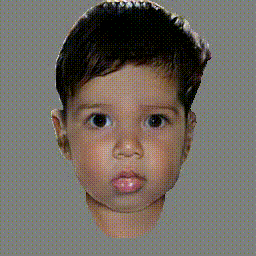

# awesome-colab-zoo

Repo contains working links or codes for running most popular deep learning pretrained models with custom inputs in colab

**Contents**

- Object classification
- Object detection
- Object tracking
- GAN
    - Age progression and regression GANs
        - [Lifespan GAN](https://github.com/royorel/Lifespan_Age_Transformation_Synthesis) link [here](https://colab.research.google.com/github/royorel/Lifespan_Age_Transformation_Synthesis/blob/master/LATS_demo.ipynb)
- Human pose estimation

**Gallery**

